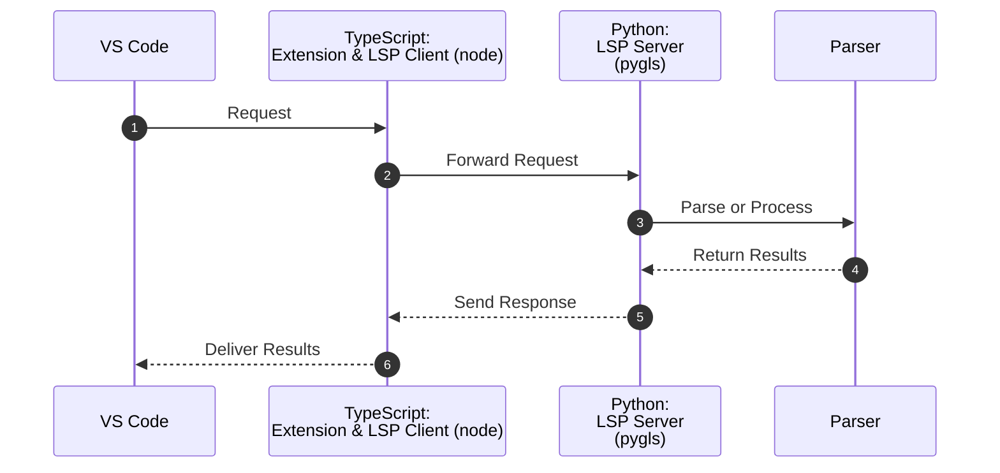

## Visual Code Extension using LSP

- Generic programming languages are often complex and have many features, which makes it challenging to learn the skills for developing the Visual Studio Code extension using LSP (Language Server Protocol). To simplify this, the code defines a toy language called Power Fx Alpha, which is based on Power Fx syntax.
- PowerFxAlpha simplifies complex types and adds syntax for `imports` and `custom-defined functions`. PowerFxAlpha supports only parser.
    - The samples are in the `syntaxes/powerfx-script-sample` directory.
    - Power Fx is a low-code language used in the Microsoft Power Platform, mainly in Power Apps, which is a low-code application development tool.
    - The PowerFxAlpha lexer, parser, and TextMate grammar were generated using GPT. The grammar files are based on Power Fx expression-grammar.grammar from the [official Power Fx documentation](https://learn.microsoft.com/en-us/power-platform/power-fx/expression-grammar).

> Important: The code in this repository is intended for proof-of-concept purposes only.

## Visual Code extension overview

- VS Code <-> Type script: Extension & LSP Client (node) <-- LSP -- > Python: LSP Server (pygls) <-> Parser



### Example Implementations:

- [Extension & LSP Client - ANSI C Example](https://github.com/lextm/vscode-ansic): The `src\languageServer` directory in the repository is actually an LSP client.
- [Language Server (LSP Backend & Parser) - ANSI C Example](https://github.com/lextm/ansi-c-antlr): The VS Code extension officially supports the Node SDK for the LSP server. However, the repository implements the LSP server using C#. The official documentation for the VS Code extension states that `The language server can be implemented in any language, as long as it can communicate with the language client using the Language Server Protocol.`
- [Video Overview on YouTube](https://youtu.be/H0p7tcUuJm0?si=QTLL3FOubsJoxEW_)

## Language Definition & Configuration

- `package.json`: add your new language support configuration in the "contributes" section.
- Language Configuration (Optional): If you want to add additional features like comment toggling, create a `language-configuration.json` file.
- `PowerFxAlphaLexer.g4`: PowerFxAlpha lexer
- `PowerFxAlphaParser.g4`: PowerFxAlpha parser
- `PowerFxAlpha.tmLanguage.json`: TextMate grammar
- `expression-grammar.grammar`: official Power Fx expression grammar

> Rename `vscode-client/src/config.template.json` to `vscode-client/src/config.json` and fill out the values in the config.

## Server and Client Setup

#### Server
To start the server, run the following command in your terminal:

```bash
python server/lsp_server.py
```

#### Client
To run the client, follow these steps:

1. Open the project in Visual Studio Code.
2. Navigate to `vscode-client/src/extension.ts`.
3. Click on the `Run` menu in Visual Studio Code.
4. Select `Start Debugging (F5)`.

#### Debug Mode
- If you set `debugMode` to `true` in `vscode-client/src/config.json`, the server and client will connect via TCP at `127.0.0.1` on port `8080`. otherwise, the client will automatically launch the server as a child process using the defined Python path in `vscode-client/src/config.json`.

#### Features

https://github.com/user-attachments/assets/e7dc6464-c559-4d91-8498-02e11ea42cd9

1. Hover (Echo): Show info when hovering over code elements.  
2. Rename Function: Rename function's name in the code context.  
3. Custom Notification: Create a command for notifications through user input from client-server communication.  
4. Client Notification: Enable the client to pop up a hello-world notification by command.  
5. Syntax Highlighting: Implement syntax highlighting.  

## References

1. [Create Your First Extension](https://microsoft.github.io/vscode-essentials/en/10-create-an-extension.html)
2. [VS Code Extension API](https://code.visualstudio.com/api/language-extensions/language-server-extension-guide) > [VS Code Extension Samples](https://github.com/microsoft/vscode-extension-samples) & [Example language server](https://vscode-docs.readthedocs.io/en/stable/extensions/example-language-server/)
3. [Language Server Protocol Samples](https://github.com/microsoft/vscode-extension-samples/tree/main/lsp-sample)
4. [Language Server Protocol Documentation](https://microsoft.github.io/language-server-protocol/) > [Template for VS Code Python Tools Extensions](https://github.com/microsoft/vscode-python-tools-extension-template)
5. [Integrate Language-Server with VS-Code extension](https://medium.com/nerd-for-tech/integrate-language-server-with-vs-code-extension-ffe8f33a79cf)
6. [Python extension for Visual Studio Code](https://github.com/microsoft/vscode-python)
7. [Readthedocs.io](https://vscode-docs.readthedocs.io/en/stable/extensions/example-language-server/)
8. [Power Fx kernel for .NET Interactive](https://github.com/rajyraman/Power-Fx-.NET-Interactive)
9. [pygls](https://pygls.readthedocs.io/en/latest/): A Pythonic generic implementation of the Language Server Protocol. The SDK is designed for a JSON-RPC interface and is not specific to the Python programming language. (pygls v2.0) [git](https://github.com/openlawlibrary/pygls)

